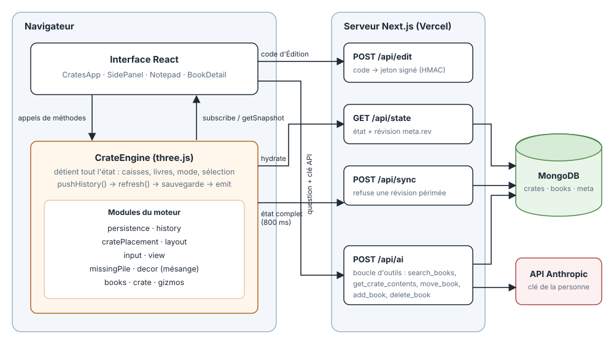

# Bibliothèque

Range tes livres dans des caisses, en 3D. Une appli Next.js où chaque caisse en bois (ou transparente)
contient ses livres, avec leur couverture, leur tranche et leur résumé au dos. Les données vivent dans
MongoDB ; un assistant Claude peut répondre aux questions sur la collection et la modifier.

## Ce que fait l'appli

- **Scène 3D** : caisses petites, moyennes, grandes ou transparentes, empilables (gravité et aimantation), livres
  debout ou à plat, couvertures et tranches dessinées.
- **Lecture** (mode par défaut) : cliquer un livre le sort devant toi, le retourne pour lire le résumé, et montre
  les voisins (précédent / suivant) à côté. La fiche (titre, auteur, éditeur, année, type, résumé, série) est à droite.
- **Recherche** en grand en haut : sans accents, avec une faute de frappe tolérée ; Entrée présente tous les
  résultats devant toi, du premier au dernier.
- **Édition** : déplacer et tourner les caisses. Protégée par un code vérifié côté serveur.
- **Claude** : une conversation pour interroger ta bibliothèque, avec ta propre clé API. Bouton 🎤 pour dicter la question, la réponse reste écrite.
- **Téléphone** : un seul livre à la fois, au maximum de l'écran, parcouru avec ‹ ›, boutons Biblio et Claude.

## Installation

Prérequis : Node.js 20 ou plus et une base MongoDB (locale ou Atlas).

```bash
npm install
cp .env.local.example .env.local   # puis renseigner la connexion MongoDB
npm run dev                        # http://localhost:3000
```

Variables d'environnement (`.env.local`, jamais versionné) :

| Variable      | Rôle                                                                         |
| ------------- | ---------------------------------------------------------------------------- |
| `MONGODB_URI` | chaîne de connexion MongoDB (obligatoire : sans base, rien n'est sauvegardé) |
| `MONGODB_DB`  | nom de la base (`bibliotheque` par défaut)                                   |
| `EDIT_CODE`   | code qui déverrouille l'Édition (sans lui, l'Édition est désactivée)         |
| `EDIT_SECRET` | clé de signature du jeton d'Édition (facultative)                            |

Au premier lancement, la base est vide : l'appli crée des caisses de départ.

## Commandes

```bash
npm run dev          # serveur de développement
npm run build        # build de production
npm run lint         # eslint
npm run typecheck    # tsc --noEmit
npm test             # vitest
npm run test:cov     # avec couverture (seuil 100 % sur le moteur, le code serveur, les helpers)
npm run check        # typecheck + lint + tests avec couverture
npm run format       # prettier
```

## Données

Deux collections dans MongoDB : `crates` (caisses : taille, position, orientation), `books` (livres : titre,
auteur, couverture, dimensions, caisse, ordre), plus `meta`
(révision de l'état). Les couvertures sont des fichiers dans `public/covers/`.

L'appli envoie l'état complet à la base à chaque modification. Une révision (`meta.rev`) empêche une page
ouverte d'écraser une modification faite ailleurs : elle recharge la base à la place.

## Assistant Claude

Le panneau Claude pose des questions à Claude sur la collection (« où est La Hulotte n°8 ? »,
« quels livres de Robin Hobb ai-je ? »). Claude interroge la base avec des outils (`src/lib/library.ts`) et, si
l'Édition est déverrouillée, peut aussi déplacer, ajouter ou supprimer un livre (la suppression demande une
confirmation).

Chaque personne saisit **sa propre clé API Anthropic** : elle reste dans son navigateur (`localStorage`), n'est
envoyée au serveur que pour la requête en cours, et n'est ni enregistrée ni journalisée. Chaque question consomme
du crédit sur le compte de la clé utilisée.

## Architecture



L'état vit dans le moteur, pas dans React. Chaque modification passe par `pushHistory()` puis `refresh()`
(placement, disposition des livres, sauvegarde, notification).

## Structure

```
src/app/            page unique et routes API (state, sync, edit, ai, books)
src/engine/         moteur three.js : CrateEngine, livres, caisses, gizmos
src/components/     interface React (CratesApp, SidePanel, BookDetail, SearchBar, Notepad…)
src/lib/            code serveur partagé : MongoDB, code d'Édition, outils de Claude
public/covers/      couvertures des livres
.claude/skills/     compétences du projet (séries incomplètes)
```

Voir `CLAUDE.md` pour l'architecture détaillée et les conventions.
