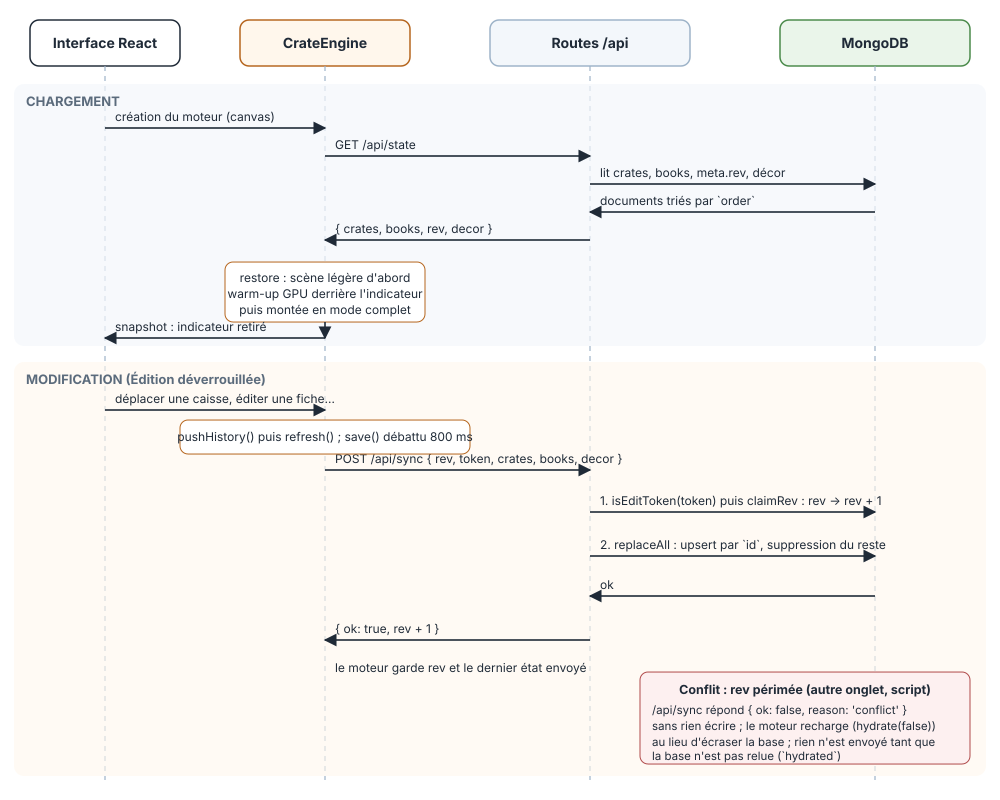
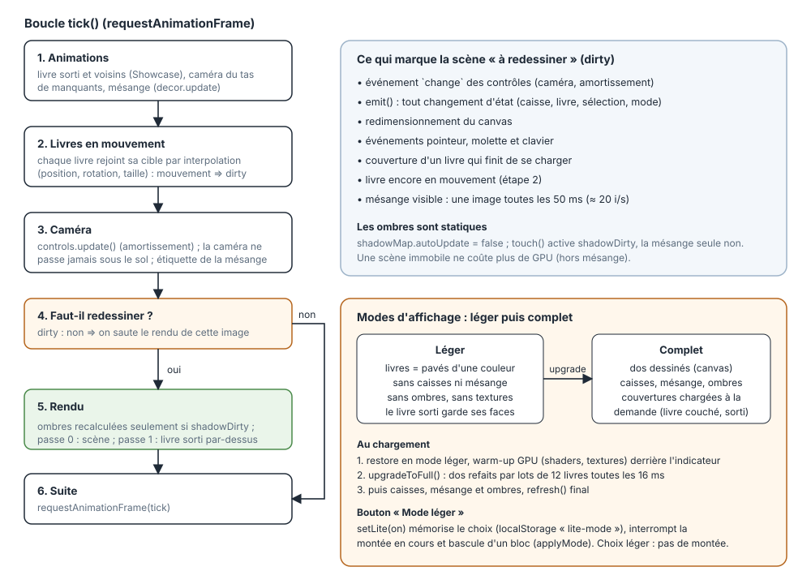
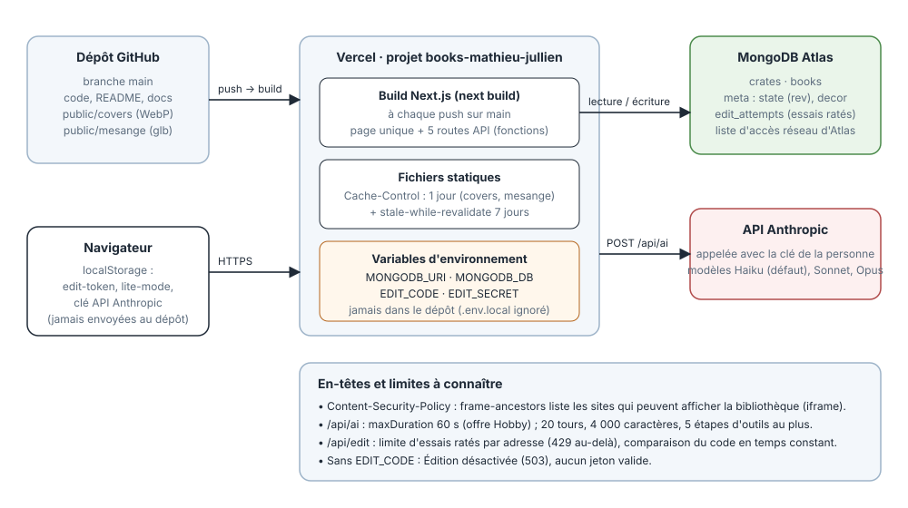
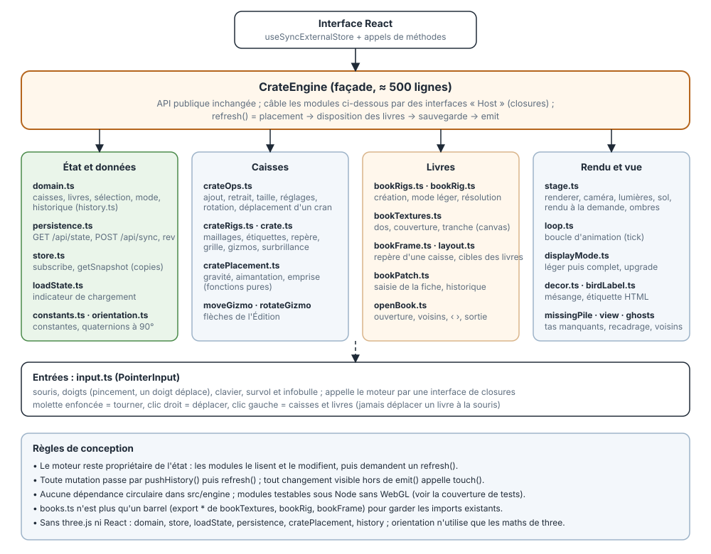

# Architecture

Schémas du plus large au plus précis. Les fichiers SVG sont dans ce dossier.

## 1. Vue d'ensemble

L'état du domaine (caisses, livres, mode, sélection, historique) vit dans `CrateEngine`, pas dans React :
l'interface s'y abonne (`subscribe` / `getSnapshot`) et appelle ses méthodes. MongoDB est la seule
persistance.

## 2. Données : chargement et sauvegarde

- Au démarrage le moteur lit `/api/state` ; tant que la base n'est pas lue (`hydrated`), rien n'est envoyé.
- Chaque modification passe par `pushHistory()` puis `refresh()` ; l'état complet est envoyé (débattu 800 ms).
- `meta.rev` empêche d'écraser une modification faite ailleurs : en cas de conflit, le moteur recharge.
- L'écriture se fait par `id` (upsert puis suppression du reste), jamais en vidant une collection.

## 3. Rendu : boucle et modes d'affichage

- La scène n'est redessinée que si quelque chose a changé (`dirty`) ; la mésange seule redessine à ~20 i/s.
- Au chargement la scène légère s'affiche d'abord, puis le mode complet arrive par petits lots.
- Tout nouvel état visible qui ne passe pas par `emit()` doit appeler `touch()`.

## 4. Déploiement et environnement

## 5. Modules du moteur

`CrateEngine` est une façade d'environ 500 lignes : il câble les modules par des interfaces « Host » (closures)
et garde les mêmes méthodes publiques. Les modules sans three.js ni React (`domain`, `store`, `loadState`,
`persistence`, `cratePlacement`, `history`) se testent sous Node.
